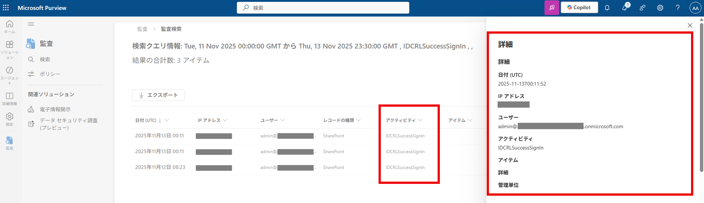

この投稿では、Microsoft 365 管理センターのメッセージ センターに MC1184649 として掲載されている IDCRL 認証の廃止について記載します。
SharePointOnlineCredentials クラスなどの IDCRL プロトコルを使ったソリューションをご利用の場合は、先進認証に切り替える必要がありますのでご確認ください。
※IDCRL 認証の廃止に関する最新の情報は、メッセージ センターにて MC1184649 をご確認ください。

<!-- more -->

## IDCRL 認証の廃止について

SharePoint Online および OneDrive for Business では、従来の IDCRL (Identity Client Run Time Library) 認証を使用することで、ユーザー/パスワード ベースの認証が可能でした。
しかしながら、このような従来の認証方式では、条件付きアクセスや多要素認証 (MFA) などの最新のセキュリティ技術を使用することができないため、先進認証への切り替えが推奨されていました。
今後は、従来の認証方式によるセキュリティ リスクを軽減するため、IDCRL 認証がブロックされる動作となります。

### IDCRL 認証の廃止のスケジュール
2026/1/31 以降は既定で IDCRL 認証がブロックされます。Set-SPOTenant コマンドで AllowLegacyAuthProtocolsEnabledSetting と LegacyAuthProtocolsEnabled を True に設定することで、2026/4/30 までは IDCRL 認証を使用できます。
2026/5/1 以降は、IDCRL 認証がテナント全体で完全にブロックされます。
最新のスケジュールはメッセージ センターの MC1184649 をご確認ください。

## IDCRL 認証の使用状況を確認する方法

テナントで IDCRL 認証が使用されているかどうかは Microsoft Purview 監査ログの "IDCRLSuccessSignIn" アクティビティを検索することでご確認いただけます。
 
1. 管理者アカウントで、Microsoft Purview (https://purview.microsoft.com/)  にサインインします。
2. 左側メニュー [監査] をクリックします。
3. アクティビティで "IDCRLSuccessSignIn" を指定します。
4. 検索の開始日と終了日を指定して、[検索] をクリックします。
5. 検索ジョブが登録されますので、しばらくして "ジョブの状態" が "完了済み" になりましたら、検索名をクリックして内容を確認します。
6. "IDCRLSuccessSignIn" アクティビティが記録されている場合、IDCRL 認証が使用されていると判断できます。


下記のブログ記事も合わせてご確認ください。

タイトル : Migrating from IDCRL authentication to modern authentication in SharePoint
アドレス : https://devblogs.microsoft.com/microsoft365dev/migrating-from-idcrl-authentication-to-modern-authentication-in-sharepoint/

## IDCRL 認証から先進認証への移行方法

先進認証への移行では、Microsoft Authentication Library (MSAL) を利用し、OAuth ベースでトークンを取得する方法が推奨されます。
CSOM で先進認証を使用する手順については、以下の公開情報をご参照ください。

タイトル : CSOM for .NET Framework の代わりに CSOM for .NET Standard を使用する
アドレス : https://learn.microsoft.com/ja-jp/sharepoint/dev/sp-add-ins/using-csom-for-dotnet-standard

※（2026/2/4 追記）公開情報のタイトルに「CSOM for .NET Framework の代わりに CSOM for .NET Standard を使用する」と記載がありますが、CSOM for .NET Framework でも OAuth ベースの認証を使用することは可能です。

### SharePointOnlineCredentials クラスを使って先進認証に対応する

CSOM の SharePointOnlineCredentials クラスで IDCRL 認証を使用している場合は、Microsoft.SharePointOnline.CSOM パッケージを 16.1.26615.12013 以降にアップグレードすることで先進認証に対応できます。
最新のパッケージは NuGet Gallery よりダウンロードいただけます。

タイトル : NuGet Gallery | Microsoft.SharePointOnline.CSOM
アドレス : https://www.nuget.org/packages/Microsoft.SharePointOnline.CSOM

パッケージのアップグレード後、認証部分を以下のように書き換えます。
※ ユーザーの多要素認証 (MFA) が有効な場合は 4 つ目の引数 (interactiveAuth パラメータ) に True を指定します。

PowerShell の例
``` PowerShell
$credentials = New-Object Microsoft.SharePoint.Client.SharePointOnlineCredentials({username}, {password}, {useModernAuth:true}, {interactiveAuth:true/false});
```
実行例
``` PowerShell
$credentials = New-Object Microsoft.SharePoint.Client.SharePointOnlineCredentials($user, $password, $true, $false);
```
### PnP PowerShell を使って先進認証に対応する

Microsoft Entra ID に登録したアプリケーションを介して認証を行いたい場合は、PnP PowerShell を使用する方法が最も工数の少ない切り替え方法になります。
具体的には、Connect-PnPOnline コマンドで SharePoint Online に接続後、Get-PnPContext コマンドで ClientContext クラスのオブジェクトを取得することで、後述の CSOM スクリプトを実行することが可能です。

1. CSOM スクリプトの認証部分を以下のように書き換えます。

``` PowerShell
Connect-PnPOnline -Url "https://<tenant>.sharepoint.com/sites/<SiteName>" -ClientId "<アプリケーション (クライアント) ID >" -Tenant "<テナント ドメイン>" -Interactive
```

実行例
``` PowerShell
Connect-PnPOnline -Url "https://contoso.sharepoint.com/sites/test" -ClientId "11111111-2222-3333-4444-555555555555" -Tenant "contoso.onmicrosoft.com" -Interactive
```
2. Get-PnPContext コマンドで ClientContext クラスのオブジェクトを取得します。

``` PowerShell
$ctx = Get-PnPContext
```
3. 後続の処理を実行します。以下は、サイト名を取得するサンプル スクリプトです。

``` PowerShell
$web = $ctx.Web;
$ctx.Load($web);
$ctx.ExecuteQuery();
Write-Host "サイト タイトル: $($web.Title)";
```

#### PnP の補足情報
PnP PowerShell は、Microsoft が主導するオープンソース プロジェクトとして開発が行われております。
ベストプラクティスに沿った、すぐに利用できる多数のコマンドが多数あり、開発/運用コストの削減のメリットから、多くのお客様が利用している実績もございます。 
ただし、コミュニティを介してサポートが提供される形態となっており、一般的な利用方法や利用時の問題等の全般的な質問については、はじめに GitHub のコミュニティ上で開発者と直接やり取りし情報収集をしていただく必要がございます。
この点につきましては、予めご了承くださいますようお願いいたします。

タイトル : PnP PowerShell の概要
アドレス : https://learn.microsoft.com/ja-jp/powershell/sharepoint/sharepoint-pnp/sharepoint-pnp-cmdlets

#### PnP PowerShell の利用開始手順は、以下のドキュメントをご参照ください。

タイトル : PnP PowerShell
アドレス : https://pnp.github.io/powershell/
 
タイトル : Authentication
アドレス : https://pnp.github.io/powershell/articles/authentication.html

今回の記事は以上となります。 ご不明点等がありましたら、弊社サポート サービスまでお気軽にお問い合わせください。  


